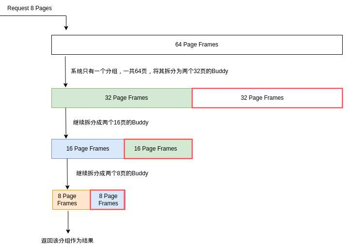

# Buddy 算法

## Buddy 算法介绍

Buddy算法是一种用于管理计算机操作系统内存的分配和释放的算法。它通常用于管理操作系统的物理内存（RAM）中的空闲块，以便有效地满足不同大小的内存分配请求。  

Buddy算法的核心思想是将物理内存划分为大小相等的块（通常是2的幂次方大小）。这些块以二叉树的形式组织，其中每个节点表示一个内存块，每个节点的子节点是其一半大小的块。树的根节点表示整个可用内存。  

当有一个内存分配请求时，Buddy算法会搜索二叉树，找到合适大小的内存块来满足请求。如果找到的块比请求的稍大，它将被分割成两个较小的块，其中一个块被分配给请求，而另一个块被插入到合适大小的内存块链表中。如果找到的块比请求的大得多，它将被分割成两个更小的块，然后继续搜索较小的块，直到找到适合的块为止。  

当内存被释放时，Buddy算法会检查相邻的块是否也是空闲的，并尝试将它们合并成一个较大的块。这个过程称为"合并"或"合并回"，可以防止内存碎片化，使系统更有效地管理内存。  

Buddy算法的优点包括分配和释放内存的速度相对较快，并且减少了内存碎片化的问题。它通常用于操作系统的内核中，以管理物理内存的分配，例如在Linux内核中使用。但是，Buddy算法也有一些缺点，例如内存浪费，因为要求分配的内存大小必须是2的幂次方，可能会导致某些浪费。此外，Buddy算法不太适合管理虚拟内存（虚拟内存通常使用更复杂的分页算法）。  

## Buddy（伙伴的定义）

这里给出伙伴的概念，满足以下三个条件的称为伙伴：

- 两个块大小相同
- 两个块地址连续
- 两个块必须是同一个大块中分离出来的

我们定义Buddy这个概念的目的是在内存分配与释放的过程中，能够动态地维护尽可能长的连续内存。  

## 算法详细思路

### 请求内存

当系统收到一个内存分配请求时，Buddy算法按以下步骤操作：

1.计算块大小：首先，算法计算出满足请求所需的最小块大小，这个大小是2的幂次方（例如，请求为35字节，最小块大小将是64字节，即2的6次方）。

2.寻找合适的块：接着，算法在内存的空闲块列表中查找第一个足够大的块。如果找到的块大小恰好等于计算出的最小块大小，则直接分配这个块。

3.分割块：如果找到的块比需要的大，则将这个块分割成两个更小的块（每个块大小是原来的一半），然后重复这个过程，直到得到一个大小合适的块。

4.标记和返回地址：分配适当大小的块后，标记这个块为已分配，并返回其起始地址。

### 释放内存

1.释放内存时，Buddy算法执行以下步骤：

2.寻找伙伴块：然后，算法寻找刚释放块的“伙伴”块。两个伙伴块大小相同，地址相邻，并且在二进制表示中只有一位不同。

3.合并伙伴块：如果伙伴块也是空闲的，则将这两个块合并成一个更大的块。然后，算法继续检查合并后的块是否有空闲的伙伴块，如有则继续合并。这个过程一直进行，直到没有可合并的伙伴块。

4.标记块为可用：将要释放的内存块标记为可用。

5.更新空闲块列表：最后，更新空闲块列表，反映合并后的空闲块的状态。

## 参考资料

[Linux 核心概念讲解](https://s3.shizhz.me/linux-mm/3.2-wu-li-nei-cun/3.2.4-buddy-system-huo-ban-xi-tong)
